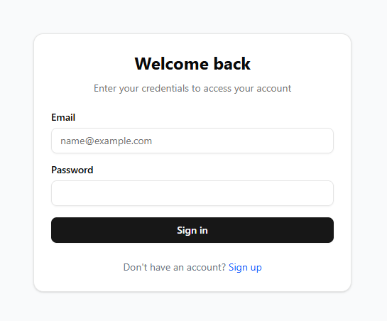
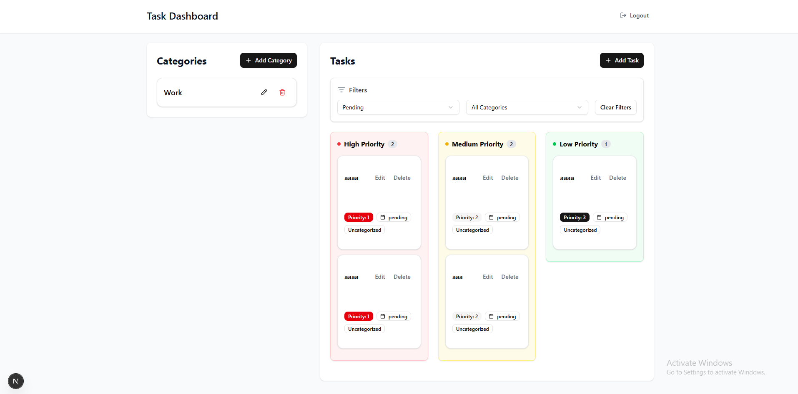
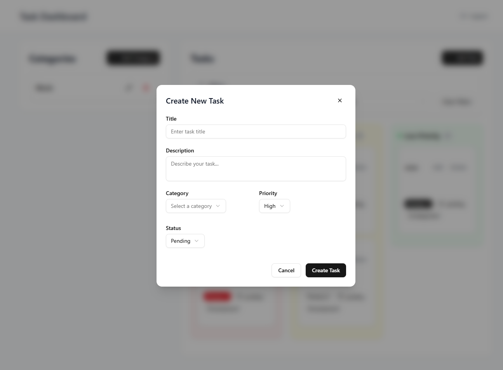
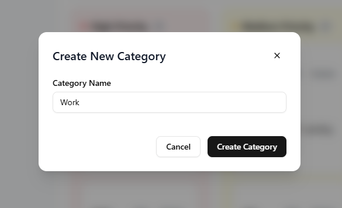

# Task Management Application

A modern task management application built with Next.js, Supabase, and shadcn/ui. This application allows users to manage tasks with categories, priorities, and status tracking.

## Features

- User authentication (Sign up, Login, Logout)
- Task management (Create, Read, Update, Delete)
- Category management
- Priority-based task organization
- Status tracking
- Drag and drop task prioritization
- Modern UI with shadcn components
- Responsive design

## Prerequisites

- Node.js (v18 or higher)
- npm or yarn
- Supabase account
- PostgreSQL database

## Installation

1. Clone the repository:
```bash
git clone <repository-url>
cd FOUNDERS
```

2. Install dependencies for both frontend and backend:
```bash
# Install frontend dependencies
cd frontend
npm install

# Install backend dependencies
cd ../backend
npm install
```

3. Set up environment variables:

Create a `.env` file in the frontend directory:
```env
NEXT_PUBLIC_SUPABASE_URL=your_supabase_url
NEXT_PUBLIC_SUPABASE_ANON_KEY=your_supabase_anon_key
NEXT_PUBLIC_API_URL=http://localhost:4000
```

Create a `.env` file in the backend directory:
```env
PORT=4000
SUPABASE_URL=your_supabase_url
SUPABASE_SERVICE_KEY=your_supabase_service_key
JWT_SECRET=your_jwt_secret
```

4. Set up the database:

Create the following tables in your Supabase database:

```sql
-- Users table (automatically created by Supabase Auth)

-- Categories table
create table categories (
  id uuid default uuid_generate_v4() primary key,
  name text not null,
  user_id uuid references auth.users(id) on delete cascade,
  created_at timestamp with time zone default timezone('utc'::text, now()) not null
);

-- Tasks table
create table tasks (
  id uuid default uuid_generate_v4() primary key,
  title text not null,
  description text,
  category_id uuid references categories(id) on delete set null,
  priority integer not null default 3,
  status text not null default 'pending',
  user_id uuid references auth.users(id) on delete cascade,
  created_at timestamp with time zone default timezone('utc'::text, now()) not null,
  updated_at timestamp with time zone default timezone('utc'::text, now()) not null
);

-- Enable Row Level Security
alter table categories enable row level security;
alter table tasks enable row level security;

-- Create policies
create policy "Users can view their own categories"
  on categories for select
  using (auth.uid() = user_id);

create policy "Users can insert their own categories"
  on categories for insert
  with check (auth.uid() = user_id);

create policy "Users can update their own categories"
  on categories for update
  using (auth.uid() = user_id);

create policy "Users can delete their own categories"
  on categories for delete
  using (auth.uid() = user_id);

create policy "Users can view their own tasks"
  on tasks for select
  using (auth.uid() = user_id);

create policy "Users can insert their own tasks"
  on tasks for insert
  with check (auth.uid() = user_id);

create policy "Users can update their own tasks"
  on tasks for update
  using (auth.uid() = user_id);

create policy "Users can delete their own tasks"
  on tasks for delete
  using (auth.uid() = user_id);
```

5. Start the development servers:

```bash
# Start the backend server
cd backend
npm run dev

# In a new terminal, start the frontend server
cd frontend
npm run dev
```

The application will be available at:
- Frontend: http://localhost:3000
- Backend: http://localhost:4000

## Usage

1. Open http://localhost:3000 in your browser
2. Sign up for a new account or log in with existing credentials
3. Start managing your tasks and categories

## Screenshots

### Authentication

*Sign up and login interface*

### Dashboard

*Main dashboard with task list and categories*

### Task Management

*Create and manage tasks with drag-and-drop functionality*

### Category Management

*Organize tasks with custom categories*

## Tech Stack

- **Frontend**:
  - Next.js 13+ (App Router)
  - TypeScript
  - shadcn/ui
  - Tailwind CSS
  - Supabase Client
  - React DnD Kit

- **Backend**:
  - Node.js
  - Express
  - Supabase
  - PostgreSQL

## Contributing

1. Fork the repository
2. Create your feature branch (`git checkout -b feature/amazing-feature`)
3. Commit your changes (`git commit -m 'Add some amazing feature'`)
4. Push to the branch (`git push origin feature/amazing-feature`)
5. Open a Pull Request

## License

This project is licensed under the MIT License - see the LICENSE file for details. 